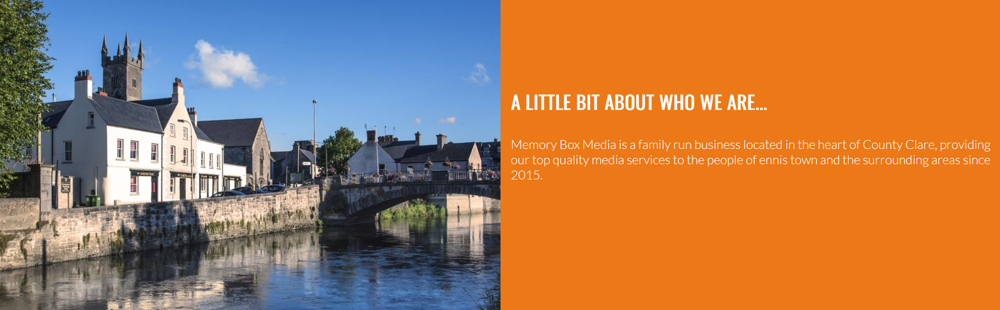

# Memory Box Media
MemoryBoxMedia is a small media business based in Ennis, Co. Clare that provide restoration and digitization services for items such as old photos or video tapes to transfer them into digital media forms and preserve them.

The aim of this website is to give users information about MemoryBoxMedia and show users what services they provide, the process and cost of those services and provide ways to get in contact with MemoryBoxMedia to make orders. 

MemoryboxMedia does currently have a website they built themselves through Weebly (http://www.memoryboxmedia.net) however it has not been updated in some time so it does need a refresh and could be improved. The Video Production section of their site was omitted for this project as they are currently much more focused on media restoration now. Their current website was very useful in providing information about their business and some relevant images for my project. 

[Link to the live project](https://alexkavanagh-dev.github.io/memory-box-media/)

# Features
## Current Features
- Navigation Menu
    - The navigation menu is placed at the top of the page and is stickied there so it is usable through the whole page as the user scrolls for quick and easy navigation anywhere on the website. 
    - The MemoryBoxMedia logo is to the left and a navigation menu is to the right.
    - The logo also acts as a link back to the website to refresh the page.
    - The navigation menu contains 3 links: Home, Services and Contact which all link to the relevant section of the page and bring the user directly to them. 

- Hero Image
    - Shows an eye-catching image that gives the user an immediate impression of what MemoryBoxMedia is centered around i.e. old photos or other media of memories. 
    - The welcome message overlayed on the hero image reinforces what the purpose of MemoryBoxMedia is.
    - Two brightly colored buttons overlayed on the hero image, one labelled 'Price List' and one 'Contact Us' give quick, stand-out routes to what users might want quick access too whether they are new or returning users. 

- How It Works Section
    - Shows users a simple three step process that goes into ordering with MemoryBoxMedia, helping ensure users that ordering with MemoryBoxMedia is simple and easy to do for the user.
    - The paragraph below informs the user that media restoration is time sensitive since physical media degrades over time to encourage users to place orders.

- Services Section 
    - Shows the four services being offered with some details about each one and the cost of that service.
    - The button at the bottom of each service displays the price for that service and when clicked will bring the user to the contact section for quick and easy navigation.
    - There is a simple solid border between each service to make each one distinct and easy to seperate from each other. 
    - This section uses CSS Grid for responsiveness and breaks down from a 1x4 grid to a 2x2 grid to a 4x1 grid as the screen gets smaller. 

- About Us Section
    - There is a short paragraph that provides some details about MemoryBoxMedia to inform user about who they are ordering from and how long they have been around. 
    - There is a complementary image of Ennis next to the text section, showing a bit of where MemoryBoxMedia is. 

- Contact Section
    - This section has a form on one side which allows the user to fill out their name, email address and a message they would like to send to the business.
    - Each input of the form is required and uses the correct input type for validation. 
    - The submit button is styled similarly to the buttons elsewhere on the page for consistency in design.
    - On the opposite side to the form is the contact details of MemoryBoxMedia including their phone number, email address and the active hours of the business to give the user more options of getting in contact. 
    - There is an interactive Google map below the contact information showing where Ennis is in Ireland, giving unfamiliar users an idea of where the business is located.

- Footer
    - The footer contains links to MemoryBoxMedias social media and a link to send them an email. As these are external links, they open in a new tab.
    - This can be useful for the user to keep up to date and see past work MemoryBoxMedia has posted. 

## Possible Future Features
- Highlight which section of the page the user is currently viewing in the navigation menu (requires javascript).
- Make the contact form send a real email to MemoryBoxMedia.
- Allow the user to make an order through the website itself without having to contact anyone. 
- Live chat service for users to get quicker responses to queries.
- A section for reviews from past customers that also allows users to add their own reviews with ratings, text review and images. 

# Testing
## Validator Testing
- HTML
    - No errors were found when run through the [W3C MarkUp Validator](https://validator.w3.org/).

- CSS
    - No errors were found when run through the [W3C CSS Validator](https://jigsaw.w3.org/css-validator/).

- Lighthouse
    - I confirmed through the lighthouse tester in chrome devtools that the colors and fonts I chose are easy to read and accessible.

## Compatibility Testing
- I checked that the website works as intended on different desktop browsers: Chrome, FireFox and Edge.
- I also checked that the website works properly on iphone and android phones. 

## Manual Testing
- I checked that all links work correctly, bringing you to the intended section of the website or intended external website and that external links open in a new tab.
- I checked that links and buttons that have hover states react accordingly when hovered over.  
- I checked that the form requires entries for all inputs before being submitted and that the email input only takes an email address. 
- I checked that the form submit button works and the form response page shows up with the correct information displayed. 
- I checked that the websites images, stylesheet, links and responsiveness all function the same and as intended when deployed to GitHub Pages.
- I checked that the interactive Google map shows up correctly and allows user to interact with it. 

## Responsive Testing
- I checked that the website is responsive, looks good and works well on different screen sizes as small as the iphone 5 using responsive dev tools. 
- I double checked the same as above on an actual mobile phone to ensure proper responsiveness. 
- I checked that the Google map still displayed correctly and was interactive on mobile. 

## Fixed Bugs
- The images and stylesheet were not working when I originally deployed to GitHub Pages. This was due to having used absolute file paths instead of relative file paths and fixed by removing the `/` at the beginning of file paths. 
- The navigation menu was being covered by the about us section when at the bottom of the website which was preventing the navigation links from being clicked. This was fixed by changing the z-index of the navigation menu to always be on top. 
- The Google map in the contact section dissappeared when changing the flex direction of its container to column but this was solved by giving it a height specified in pixels when the flex direction had to be changed to column. 
- On mobile screen sizes, the contact button brought you to the form at the bottom of the page but the first input for 'name' was cut off. I added some padding to the top to fix this. 
- The hover state for buttons on this website originally darkened the text color but the lighthouse test showed that this made them hard to read. This was fixed by having the hover state darken the background color instead.

## Unfixed Bugs
- No unfixed bugs that I am aware of. 

# Deployment
The website is currently deployed to GitHub Pages.

The steps to deploy it were as follows: 
- Go to the repository that is to be deployed.
- In that repository, navigate to the settings page.
- In the sidebar of the settings page, open the Pages tab. 
- In the branch section, use the drop down menu to select which branch to deploy. For me, it was just the main branch. 
- Click the save button and shortly after you can refresh the page where a link will now show up to the deployed website.  

The link for my website on GitHub Pages is here: https://alexkavanagh-dev.github.io/memory-box-media/

# Credits
## Content

- Text content about MemoryBoxMedia and their services was used for this website.

## Media
- The image for the MemoryBoxMedia logo and the image of the custom printed DVD next to a VHS tape were taken from the current  MemoryBoxMedia webiste (http://www.memoryboxmedia.net).
- I used the website, https://imagecolorpicker.com/en, to pull the two colors used in MemoryBoxMedias logo for use as the primary and secondary colors of my website. 
- The picture of Ennis in the about us section was taken from clare.ie
- The remainder of images used were taken from Unsplash.com
- The icons used in the footer for the social media links are from Font Awesome.
- I used the https://ui.dev/amiresponsive website to create the image in this readme showing how the website looks on different devices. 

## Code
- The code for the Google map section was adapted from https://www.w3schools.com/graphics/google_maps_intro.asp
- The fonts used on this website are the 'Lato' and 'Oswald' fonts imported from Google Fonts.
- The code for flexbox and CSS grid used here was learned from the W3School sections for each. 
